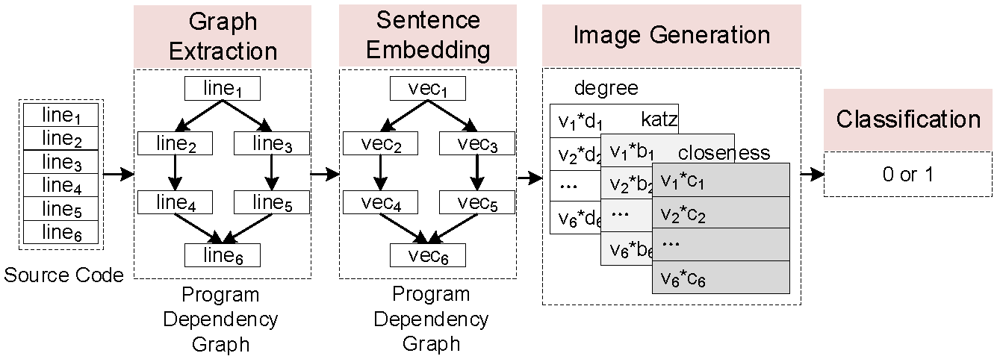

# VulCNNMiz: Detecting Software Code Vulnerabilities Using 2D Convolutional Neural Networks with Program Slicing Feature Maps
This is a modified deep learning-based vulnerability detection architecture of [VulCNN](https://github.com/CGCL-codes/VulCNN) that uses an additional code feature. VulCNN uses centrality metrics to train vulnerable and non-vulnerable code graph representations such as; Degree, Katz, Closeness. These three metrics were multipled with the vector generated by a sentence embedding (sent2vec), and given as 3-channels. However, we found that the variety between the metrics were significantly not different. Therefore, we replaced the Degree with another metric called Destructibility, which is actually derived from forward slicing.

## Design of VulCNN/VulCNNMiz
 
 
VulCNN/VulCNNMiz consists of four main phases:
Graph Extraction, Sentence Embedding, Image Generation, and
Classification.
1. Graph Extraction: Given the source code of a function,
we first normalize them and then perform static analysis to
extract the program dependency graph of the function.
2. Sentence Embedding: Each node in the program depen-
dency graph corresponds to a line of code in the function.
We regard a line of code as a sentence and embed them into
a vector.
3. Image Generation: After sentence embedding, we apply
centrality analysis to obtain the importance of all lines of code and multiply them by the vectors one by one. The
output of this phase is an image.
4. Classification: Our final phase focuses on classification.
Given generated images, we first train a CNN model and
then use it to detect vulnerability.

## Dataset
We first collect a dataset from Software Assurance Reference Dataset
(SARD) ( https://samate.nist.gov/SRD/index.php) which is a project maintained by National Institute
of Standards and Technology (NIST) (https://www.nist.gov/). SARD contains a large
number of production, synthetic, and academic security flaws or vulnerabilities (i.e., bad functions) and many good functions. In our
paper, we focus on detecting vulnerability in C/C++, therefore, we
only select functions written in C/C++ in SARD. Data obtained
from SARD consists of 12,303 vulnerable functions and 21,057
non-vulnerable functions. 

Moreover, since the synthetic programs
in SARD may not be realistic, we collect another dataset from
real-world software. For real-world vulnerabilities, we consider
National Vulnerability Database (NVD) (https://nvd.nist.gov) as our collection
source. We finally obtain 1,384 vulnerable functions that belong to
different open-source software written in C/C++. For real-world
non-vulnerable functions, we randomly select a part of the dataset
in *"Deep learning-based vulnerable function detection: A benchmark"* which contains non-vulnerable functions from several open-
source projects. Our final dataset consists of 13,687 vulnerable
functions and 26,970 non-vulnerable functions.

## Source Code

#### Step 1: Code normalization
Normalize the code with normalization.py (This operation will overwrite the data file, please make a backup)
```
python ./normalization.py -i ./data/sard
```
#### Step 2: Generate pdgs with the help of joern
Prepare the environment refering to: [joern](https://github.com/joernio/joern)
```
# first generate .bin files
python joern_graph_gen.py  -i ./data/sard/Vul -o ./data/sard/bins/Vul -t parse
python joern_graph_gen.py  -i ./data/sard/No-Vul -o ./data/sard/bins/No-Vul -t parse


# then generate pdgs (.dot files)
python joern_graph_gen.py  -i ./data/sard/bins/Vul -o ./data/sard/pdgs/Vul -t export -r pdg
python joern_graph_gen.py  -i ./data/sard/bins/Vul -o ./data/sard/pdgs/No-Vul -t export -r pdg
```
#### Step 3: Train a sent2vec model
Refer to [sent2vec](https://github.com/epfml/sent2vec#train-a-new-sent2vec-model)
```
./fasttext sent2vec -input ./data/data.txt -output ./data/data_model -minCount 8 -dim 128 -epoch 9 -lr 0.2 -wordNgrams 2 -loss ns -neg 10 -thread 20 -t 0.000005 -dropoutK 4 -minCountLabel 20 -bucket 4000000 -maxVocabSize 750000 -numCheckPoints 10
```
(For convenience, we share a simple sent2vec model [here](https://drive.google.com/file/d/1o_xP_kaZBV5ghZ1WjKzXBnQYilED2PMw/view?usp=sharing) trained by using our sard dataset. If you want to achieve better performance of VulCNN, you'd better train a new sent2vec by using larger dataset such as Linux Kernel.)
#### Step 4: Generate destructibility (forward slicing) features from the pdgs
Generate the forward slice dictionaries. This will create a folder called `dictionaries` with a `.txt` file for each function input and the destructibility metric for each line. However, in the repository the `destructibility` features are already extracted and ready to be used.
```
python3 forwardSliceCreator.py
```
#### Step 5: Generate images from the pdgs
Generate Images from the pdgs with ImageGeneration.py, this step will output a .pkl file for each .dot file. If `python` doesn't work, please try `python3`.
```
python ImageGeneration.py -i ./pdgs/Vul -o ./pdgs/outputs/Vul -m ../model.bin
python ImageGeneration.py -i ./pdgs/No-Vul -o ./pdgs/outputs/No-Vul  -m ../model.bin
```
#### Step 6: Integrate the data and divide the training and testing datasets
Integrate the data and divide the training and testing datasets with generate_train_test_data.py, this step will output a train.pkl and a test.pkl file.
```
# n denotes the number of kfold, i.e., n=10 then the training set and test set are divided according to 9:1 and 10 sets of experiments will be performed
python generate_train_test_data.py -i ./pdgs/outputs -o ./pdgs/pkl/ -n 5
```
#### Step 7: Train with CNN
```
python VulCNN.py -i ./pdgs/pkl
```

## Publication
Anne Watson, Ekincan Ufuktepe, Kannappan Palaniappan.
2022. Detecting Software Code Vulnerabilities Using 2D Convolutional Neural Networks with Program Slicing Feature Maps. 
In IEEE Applied Imagery Pattern Recognition Workshop (AIPR). (To appear)

If you use our dataset or source code, please kindly cite our paper:
```
@INPROCEEDINGS{vulcnnmiz2022,
  author={Watson, Anne and Ufuktepe, Ekincan and Palaniappan, Kannappan},
  booktitle={IEEE Applied Imagery Pattern Recognition Workshop (AIPR)}, 
  title={Detecting Software Code Vulnerabilities Using 2D Convolutional Neural Networks with Program Slicing Feature Maps}, 
  year={2022},
```
